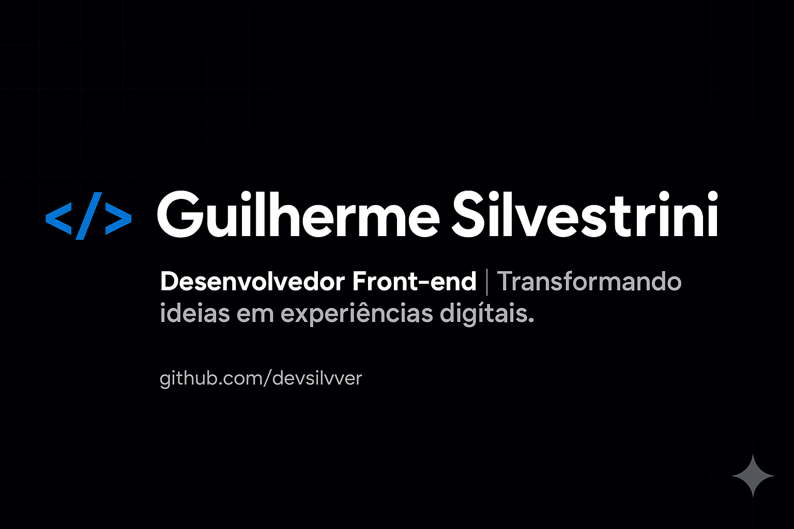

  

 

<h1 align="center">
  Olá! 👋 Eu sou o Guilherme Silvestrini
</h1>

  Um Desenvolvedor Front-end focado em transformar ideias em experiências digitais intuitivas e performáticas.

## 👨‍💻 Sobre Mim

  Sou um entusiasta de tecnologia e programação, sempre buscando aprender novas ferramentas e aprimorar minhas habilidades para criar soluções web modernas e eficientes.
  
  🌱 Atualmente estou focado em... <strong>[React e TypeScript]</strong>
   
  💡 Tenho interesse em... <strong>[UI/UX Design, Animações Web, Back-end com Node.js]</strong>
   
  📫 Você pode me encontrar em: <strong>[Votuporanga-SP]</strong>

## 🛠️ Minhas Ferramentas e Tecnologias

Aqui estão algumas das tecnologias com as quais eu trabalho:

  
  
  
  
  
  
  
  

## 📊 Minhas Estatísticas no GitHub

  
  

## 📫 Entre em Contato

Conecte-se comigo ou me envie uma mensagem:

  
  &nbsp;
  

